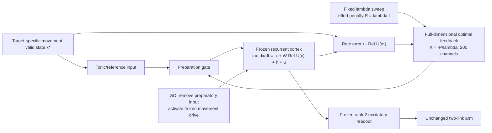

## One-sentence model
A full-dimensional optimal-feedback controller prepares each frozen movement generator, while a fixed increase in the cost of controller effort tests whether restricted preparation reproduces the experimental population-structure effects.
## Model architecture

## Minimal equations and interpretation
$$
u=u_{\mathrm{tonic}}+K_\lambda(r-r^*),\qquad
A^\top P+PA-P^2/\lambda+Q=0,\qquad K_\lambda=-P/\lambda.
$$
Q weights deviations by their future motor consequences. The controller can act through all 200 cortical channels. λ=0.1 is the reference; higher λ penalizes feedback effort more strongly. W, target states, readouts, arm and movement drive never change.
Increasing λ is a normative model of reduced availability/use of preparatory control, **not a literal cerebellar lesion or circuit model**. A low-rank motor output does not establish low-dimensional neural activity.
## Two predeclared phenotype questions
1. Does late-preparatory PR increase as λ increases?
2. Does alignment to λ=0.1 decrease below the covariance-constrained random-subspace expectation?
Use all ten frozen networks and λ=[0.1,0.2,0.5,1,2,5,10,100]. Standard preparation is 500 ms; population epochs are final100-ms Prep and first100-ms Move, sampled every10ms. Reference-only per-neuron SD normalization has a fixed floor of1 source-rate unit; all conditions use the same scales and condition-wise target centering. Fixed15-PC alignment; 1000 reference-covariance-biased null draws per network.
## Evidence and statistical plan
Three Results figures show member1 reaching after25/50/100/200ms; controller-error/perturbation operation; and reference Prep-to-Move alignment. Two Diagnostics figures show PR and reference alignment across λ. All use the preregistered definitions in Technical Specification.
Networks are the independent n=10. Faint individual networks accompany median±10,000-resample bootstrap SE where feasible. Exact paired sign-flip tests use all1024 patterns; BH correction is within each seven-λ comparison family. Per-network slopes test monotonic effects; motor-error comparisons use200ms rather than pointwise testing.
The perturbation panel is the approved Fig.4F analogue: Gaussian SD0.10 state units,100 trials×8targets×10networks, seed20260907, λ0.1,500ms, no process noise; squared errors in top/bottom-ten Q directions. Source-unspecified choices are explicitly declared, not claimed as exact numerical reproduction. Initial perturbation norms and active-set changes are descriptive checks, not tuning criteria.
## Review boundary
No outcomes exist at pre-registration. Negative/non-monotonic results will be reported unchanged. Implementation validation is distinct from phenotype success and user scientific acceptance. No later structured-cerebellar model or prediction is authorized.
